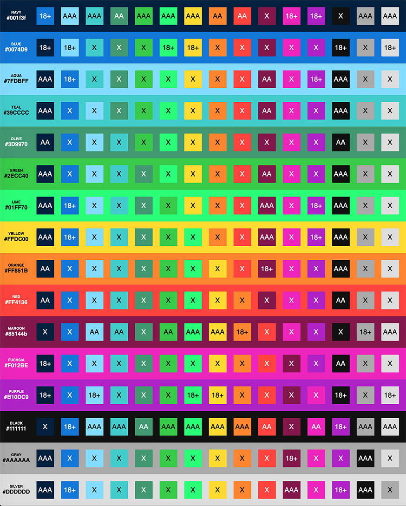

# color-contrast-table-react

Takes an array of colors and generates a table showing WCAG scores for all possible color combinations

## Install

```bash
npm install --save color-contrast-table-react
```

The package generates a chart similar to this one



## Props

| name            | type        | required | notes |
| --------------- | ----------- | -------- | ----- |
| `colors`        | `array`     | yes      | see [color-contrast-table](#color-contrast-table) |
| `useStyles`     | `boolean`   | no       | turn on default styles for chart |
| `editNames`     | `boolean`   | no       | activate input for color names, does not need to be passed if `onNamesChange` is provided |
| `editValues`    | `boolean`   | no       | activate input for color values, does not need to be passed if `onValuesChange` is provided |
| `onNamesChange` | `function`  | no       | optional callback to be fired when color name inputs change, will be passed `(colorIndex, event.target.value)` |
| `onValueChange` | `function`  | no       | optional callback to be fired when color value inputs change, will be passed `(colorIndex, event.target.value)` |
| `onInputBlur`   | `function`  | no       | optional callback to be fired on blur of any input, will be passed `(event)` |

## `color-contrast-table`

This packages uses my other color [contrast helper](https://www.npmjs.com/package/color-contrast-table) and requires a prop of `colors` of the shape specified there - an array of color value strings, or an array of objects containing `{name, value}`.

## Styles

`useStyles` prop can turn on my opinionated styles. They can be used, or not, but either way the table can be styled or overridden using [BEM syntax](http://getbem.com/) CSS classes.

### Live Editing

A prop of `editNames` or `editValues` can be passed to the `<ColorContrastChart/>` component to allow either the color name, color value, or both to be edited on the page. These will be stored in local state until the page is refreshed, contrast scores will update in real time.

If you wish to override the state local to the `<ColorContrastChart/>`, custom functions for `onNamesChange` and `onValuesChange` can be passed in via props with those same names. These functions can do whatever you want, ie - save a new value elsewhere in your app and update the array passed via the `colors` prop.

If you want to do something sparingly, like update an external database or something, you can pass a prop for `onInputBlur` which will fire an event whenever a user exits either type of input.

## License

MIT © [ryanfiller](https://github.com/ryanfiller)
